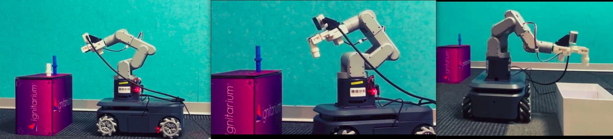

# Mobile Pick and Place

## Project Overview
The **Mobile Pick and Place** project involves a robotic arm mounted on an Autonomous Mobile Robot (AMR). The system performs pick-and-place operations autonomously by navigating to a target location, detecting and estimating the pose of objects using a YOLO-based object detection module, and executing robotic arm movements. The navigation stack and Robotics arm software is implemented using the ROS 2 Humble framework.
 
### System Workflow
1. **Navigation ( roverrobotics_ros2 )** : The AMR navigates from its current location to the designated pick and drop location using the Nav2 stack.
2. **Object Detection and 3D Pose Estimation( pose_estimation_pkg )**: A YOLO-based object detection module identifies the object and uses it for estimating the pose of the object relative to the camera.
3. **Pose Transformation**: The `rcar_communication` package transforms the pose from the camera frame to the base frame of the robotic arm.
4. **Pick-and-Place Operation**: Joint angles are calculated, and the robotic arm executes the pick-and-place task.
 
---
 
## Setup Instructions
 
### Prerequisites
- [ROS 2 Humble installed on your system](https://docs.ros.org/en/humble/Installation.html).
- Correct hardware connections for the AMR and robotic arm.
- A YOLO-based object detection model.

### Steps to Set Up the Project
 
#### 1. Create a ROS 2 Workspace and Clone repo
```bash
mkdir -p ~/ros2_ws/src
cd ~/ros2_ws/src
git clone https://github.com/Ignitarium-Renesas/R-car_Mobile_Arm.git
```
```
#### 3. Install requirements
```bash
cd ~/ros2_ws
pip install -r src/R-car_Mobile_Arm/pose_estimation_pkg/pose_estimation_pkg/libs/requirements.txt
pip install pymycobot --upgrade
```
 
#### 4. Build the Workspace
```bash
cd ~/ros2_ws
colcon build
```
 
#### 5. Run the Project
 
##### Step 1: Verify Connections
- Ensure all hardware connections are correctly set up.
- Turn on the robotic arm.
 
##### Step 2: Connect to the Robotic Arm Controller
1. Connect to the Wi-Fi access point:
   - **SSID**: ElephantRobotics_AP
2. Log in to the robotic arm controller using SSH:
```bash
ssh er@10.42.0.1
# Password: Elephant
```
3. Start the server:
```bash
./start_server.sh
```
 
##### Step 3: Launch the ROS 2 Navigation Stack
1. Open a terminal and launch the AMR  and ARM controller:
```bash
ros2 launch roverrobotics_driver rover_controller.launch.py
```
2. Open another terminal and launch the navigation stack:
```bash
ros2 launch roverrobotics_driver navigation_launch.py
```
 
##### Step 4: Activate the Camera for Pose Estimation
1. Open another terminal.
2. Navigate to the `pose_estimation_pkg` package inside its `lib` folder:
```bash
cd ~/ros2_ws/src/R-car_Mobile_Arm/pose_estimation_pkg/pose_estimation_pkg/lib
```
3. Run the camera activation script:
```bash
python3 send.py
```
 
##### Step 5: Perform the Pick-and-Place Operation
Use the following ROS 2 service to execute the demo:
```bash
ros2 service call /run_demo mecharm_interfaces/srv/PickObject {}
```
 
---
 
## Notes
- Ensure all components are powered on and properly configured before running the project.
- The navigation stack must be correctly tuned to ensure accurate AMR movement.
- Verify the YOLO object detection module is properly trained for the target objects.
- Add dockerfile.
- Add images of the different stages.
 
For troubleshooting, refer to the system logs and debug messages in the ROS 2 terminals.