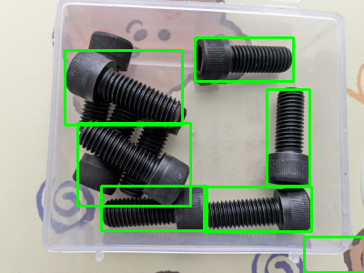

### YOLOv8 Model

<p align="center">

</p>

## Installation

```bash
python3.8 -m venv .venv
source .venv/bin/activate
pip install -U pip
pip install -r requirements.txt
```

## Usage

### Run inference:

```bash
python yolo_infer.py -n {object_name} -i {test_image_path}
```

For example, 

```bash
python yolo_infer.py -n cap_screw -i ../../dataset/cap_screw/test/PXL_20230921_082734816.png
```

*NOTE: Output of detection will be saved in given `output` directory. Default output directory is `outputs`*